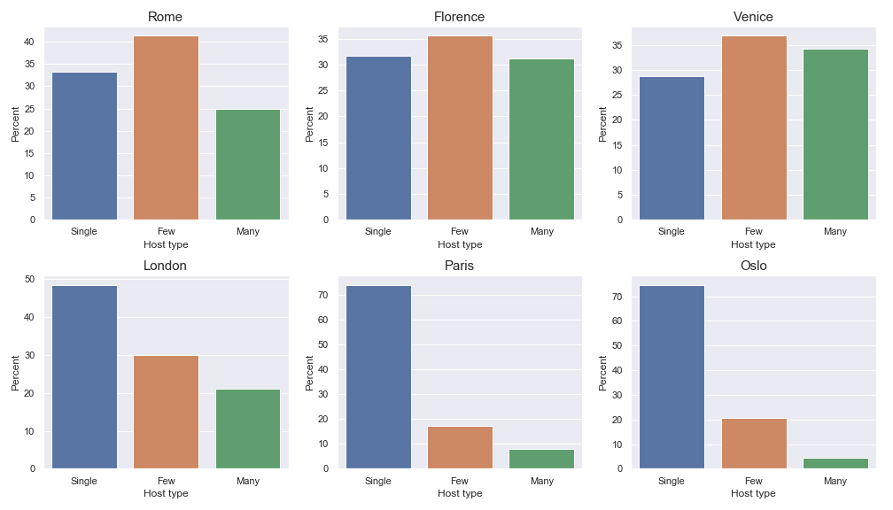
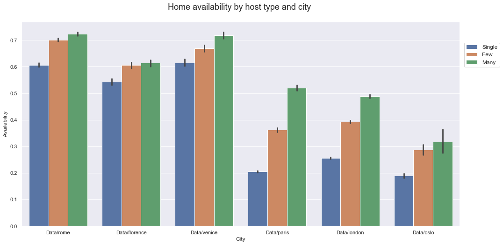
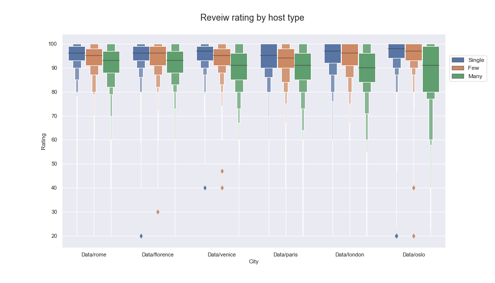
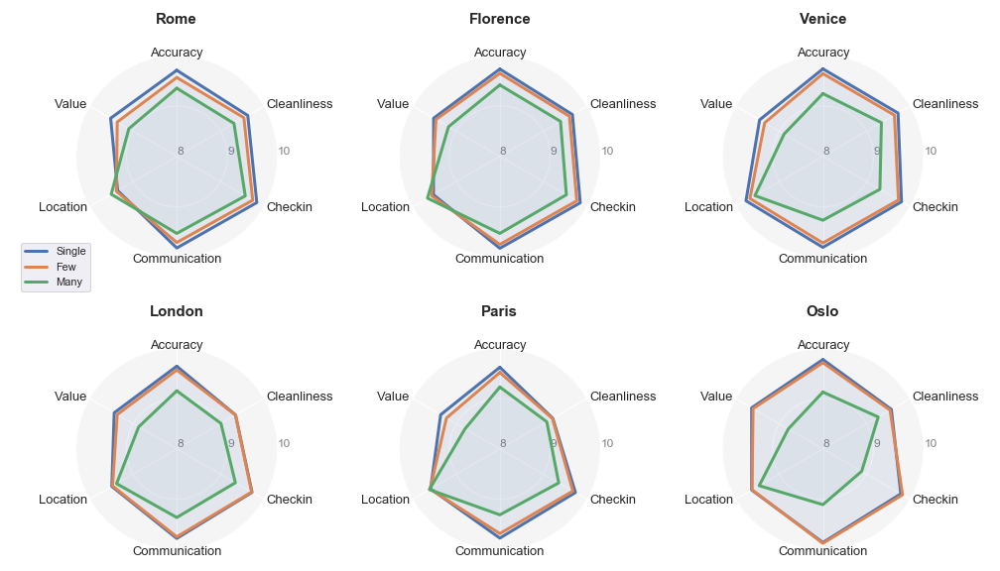
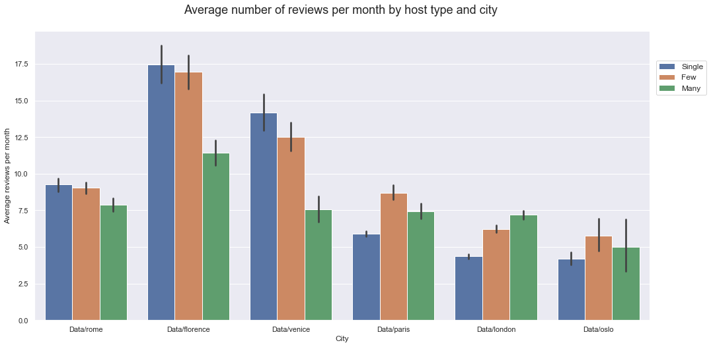

# Find your best host with AirBnb

I like AirBnB. It's a really great service. Together with Uber they are the basis and well-known examples of a new Sharing economy. (https://medium.com/r/?url=https%3A%2F%2Fen.wikipedia.org%2Fwiki%2FSharing_economy) 

We used AirBnB several times and, of course, our experience was different. Recently I was traveling with my family in Italy. We drive there with a car and just stayed every day in different cites. In Rome we stayed in one really nice apartment in the center of city, right near Piazza Navona. 

During check-in, the host, a nice lady, told us a story of the building, showed an apartment, gave a lot of additional info about the places for breakfast and so on. In the apartment itself there were a lot of helpful things as maps, discount vouchers from restaurants nearby, board games, books in different languages and so on. I really had a feeling that I'm not just a client but a welcome guest. On the door, I've found later an information letter, where the host asked to leave a review about the apartment, because it's very important for her business. Usually, I don't like to do it, especially for hotels. But here I felt some kind of empathy and personal attitude, so I did it afterwards.

My another experience with AirBnb was in Spain in Lloret de mar, where we've been several years ago in Lloret de Mar. It was just a standard apartment with a standard furniture. A guy, who met us, was like a manager in a hotel - very professional, but nothing especial. I hardly remember anything else about that apartment.

These situations make me think, that I'm more prone to have a better impression and write a review and if I had personal contact with an owner. I was curious to check is only my impression or other people also experienced this.

I used Airbnb data from [Inside AirBnB](http://insideairbnb.com/get-the-data.html) to see how hosts impact on guests and can you find the best one. I chose 6 different cities to be sure that it's not just a city specific: Rome, Florence, Venice, Paris, London and Oslo. I divide hosts by number of homes they have for rent. I guess, some host have just one extra apartment, which they rent out occasionally. For others, it's a real business. They have many apartments or it's a property management job for them.

For simplified comparison, let's see three category of hosts:
- Single (just one apartment)
- Few (from 2 to 5 apartments)
- Many (more then 5)
From this perspective, I looked at the difference in some parameters.

#### What is the structure of properties by host's type?

When I first found out about AirBnB, I was actually thinking, that hosts there are just private persons, which rent out their extra rooms/apartments/houses. But after some experience with them, I realized that it's not necessary.

First of all let's look 
So let's look at the structure of the homes' ownership, i.e a split of apartments by host type. 

It is noteworthy that, that share of apartments from single hosts depends on the cities/countries. In Italy, "professional" hosts with several or many places own/manage the most part of homes. In contrast, in Oslo and in Paris, the share of property form individual/single apartment hosts is above 70%. This could be explained by local standards, practices and legislation. In some countries, such type of business activity is very regulated and probably requires a license, while in others nobody really cares.
Good example is Norway, where government tries to tighten and clarify regulations for short-term rental of residential property https://www.newsinenglish.no/2018/12/07/norway-to-crack-down-on-airbnb/.

Inside this structure we can also look how regularly host rent out their property. Some people do it occasionally, like one of my friends who rented out their apartment just for the time of their long holidays. But some people, like my nice host in Rome, do it all the year round as it's their small business.

It's clear that homes from hosts with a single location are less available. At least other hosts have definitely another place to live. This we can be observed in every city. 

But there is another interesting point: while in Italy, the availability on of single home hosts is quite high, in other cities it's significantly lower. It seems, in Italy, even one apartment could be a regular business for a person, while in other cities, it's just occasional business.

#### Do people really care who is the host?

As a simple measure of guests feedback we can look at overall reviews rating distributions.

We can easily notice, that there is some difference between host groups: in all cities, guests appraise apartments of professionals a bit lower than host with one or several apartments. It seems, there is really some kind of correlation host type and apartment's rating.

Let's looks at the review rating by difference aspects:
- Accuracy
- Cleanliness
- Check-in
- Communication
- Location
- Value

Looking at the graph above, we see that apartments, owned/managed by "professionals", rated worse than other apartments by all criteria, except Location. This criteria is almost in line other host categories and somewhere even better (like in Rome or Florence). This actually have some sense: as a "professional" you would rather find a proper assets (apartment) in the center of city closer to touristic places then just buy something cheap. And for hosts with a single or just a few locations it's a different: you have already an apartment and decide to rent it out to have some additional income.

#### Are reviews correlating with the host's type?

Just based on my own example, when I really wanted to leave a review (for the first time), I guess other tenants had the same feelings. So I would expect that hosts with a single house for rent should have more reviews in general than other categories.

If we look at the average number of reviews per host category for each city, my guess is correct for Italian cities, but not really for others. This can be explained by selfless attitude to the own business. As we remember from "Home availability by host type", in Paris, London and Oslo, it's more likely as occasional business. In such cases, you hardly can expect a special relationship from host.

## Conclusion:

It's not really obvious to check who is your host. Normally we are concentrated on the apartment itself, but missing to check who it the host. But this can really improve your impression.

As a life-hack: booking your next holidays with AirBnB, with other parameters being equal, try to choose an apartment from a host with a single or several apartments,which are available most of the year. 
